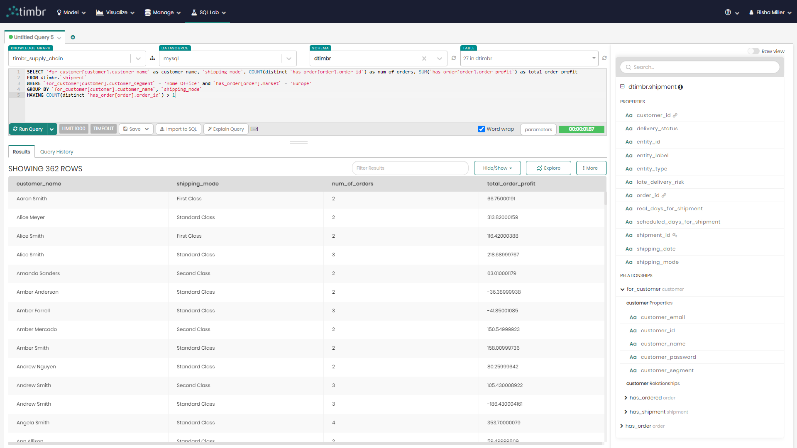

# SQL Scripts for creation of the Supply Chain Ontology Data Model
Scripts in this folder are used for **creating** concepts, relationships, views and data mappings in the Knowledge Graph Ontology.

## Scripts

| Script              | Description |
| ------------------- | ----------- |
| [create_concepts.sql](./create_concepts.sql) | Creates all the concepts that contain the relevant data in the knowledge graph. |
| [create_relationships.sql](./create_relationships.sql) | Creates the relationships that connect between the knowledge graph concepts. |
| [create_mappings.sql](./create_mappings.sql) | Creates all the data mappings in the knowledge graph. |
| [create_ontology_views.sql](./create_ontology_views.sql) | Creates 6 views in the knowledge graph. |
