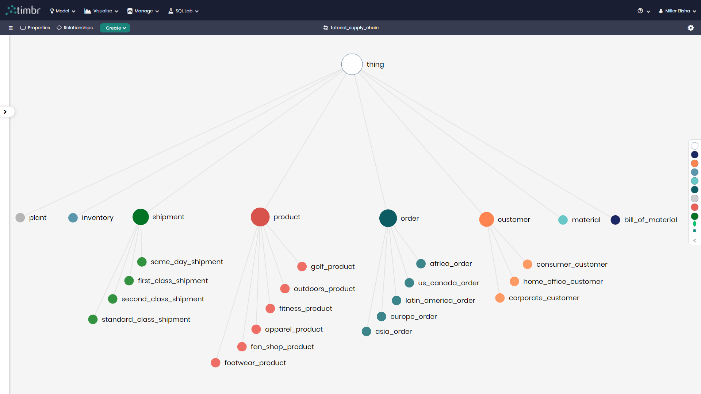
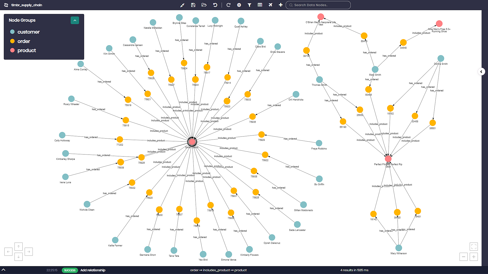
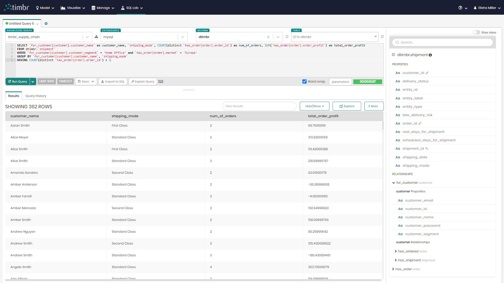
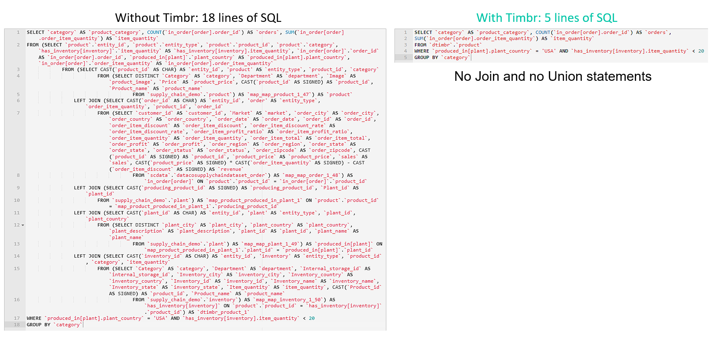

# Timbr Supply Chain Use Case Overview

The full Supply Chain Use Case can be found [here](http://supplychain-tutorial.timbr.ai/#0). 

### DESCRIPTION
This Use case overview walks through the process of building a knowledge graph from scratch on a Supply Chain use case, helping explore, analyze and visualize data in different ways using the Timbr platform. 
The use case deals with a company's supply process from production to delivery including customer information and more.

The topics that are covered in the use case include:

* Creating a virtual Knowledge Graph with hierarchies and business logic
* Mapping data from a sample database to the virtual Knowledge Graph
* Defining logical relationships between business concepts
* Using SQL statements to create the graph instantly
* Querying the Knowledge Graph using standard SQL to easily get advanced insights
* Exploring and discovering hidden relationships in the data using a graph explorer
* Creating a dashboard to represent the data with different visualizations
* Creating Semantic Views with aggregations from the Knowledge Graph

All use case samples are taken from [Timbr Environment](https://demo-env.timbr.ai/).

### The Supply Chain Ontology
Timbr’s Ontology Modeler provides a visual interface and a SQL DDL editor to easily model concepts and properties that represent the business or use-case.



### The Graph Data Explorer
Timbr’s Graph Data Explorer allows users to visualize the underlying data as a graph, to explore and discover relationships and dependencies in the data. The module enables traversing the entire organizational data so users can better understand the data, discover hidden value, visually find answers and expose the data without need of extracting tables or views before running a query.




### Semantic Queries in Timbr

Timbr's SQL Editor handles the process of creating, editing and running the semantically enabled SQL queries that require up to 90% less code than SQL queries without a knowledge graph.



### Querying without Timbr

```sql
SELECT `category` AS `product_category`, COUNT(`in_order[order].order_id`) AS `orders`, SUM(`in_order[order].order_item_quantity`) AS `item_quantity`
FROM (SELECT `product`.`entity_id`, `product`.`entity_type`, `product`.`product_id`, `product`.`category`, `has_inventory[inventory]`.`item_quantity` AS `has_inventory[inventory].item_quantity`, `in_order[order]`.`order_id` AS `in_order[order].order_id`, `produced_in[plant]`.`plant_country` AS `produced_in[plant].plant_country`, `in_order[order]`.`order_item_quantity` AS `in_order[order].order_item_quantity`
            FROM (SELECT CAST(`product_id` AS CHAR) AS `entity_id`, 'product' AS `entity_type`, `product_id`, `category`
                        FROM (SELECT DISTINCT `Category` AS `category`, `Department` AS `department`, `Image` AS `product_image`, `Price` AS `product_price`, CAST(`product_id` AS SIGNED) AS `product_id`, `Product_name` AS `product_name`
                                    FROM `supply_chain_demo`.`product`) AS `map_map_product_1_47`) AS `product`
                LEFT JOIN (SELECT CAST(`order_id` AS CHAR) AS `entity_id`, 'order' AS `entity_type`, `order_item_quantity`, `product_id`, `order_id`
                        FROM (SELECT `customer_id` AS `customer_id`, `Market` AS `market`, `order_city` AS `order_city`, `order_country` AS `order_country`, `order_date` AS `order_date`, `order_id` AS `order_id`, `order_item_discount` AS `order_item_discount`, `order_item_discount_rate` AS `order_item_discount_rate`, `order_item_profit_ratio` AS `order_item_profit_ratio`, `order_item_quantity` AS `order_item_quantity`, `order_item_total` AS `order_item_total`, `order_profit` AS `order_profit`, `order_region` AS `order_region`, `order_state` AS `order_state`, `order_status` AS `order_status`, `order_zipcode` AS `order_zipcode`, CAST(`product_id` AS SIGNED) AS `product_id`, `product_price` AS `product_price`, `sales` AS `sales`, CAST(`product_price` AS SIGNED) * CAST(`order_item_quantity` AS SIGNED) - CAST(`order_item_discount` AS SIGNED) AS `revenue`
                                    FROM `scdata`.`datacosupplychaindataset_order`) AS `map_map_order_1_48`) AS `in_order[order]` ON `product`.`product_id` = `in_order[order]`.`product_id`
                LEFT JOIN (SELECT CAST(`producing_product_id` AS SIGNED) AS `producing_product_id`, `Plant_id` AS `plant_id`
                        FROM `supply_chain_demo`.`plant`) AS `map_product_produced_in_plant_1` ON `product`.`product_id` = `map_product_produced_in_plant_1`.`producing_product_id`
                LEFT JOIN (SELECT CAST(`plant_id` AS CHAR) AS `entity_id`, 'plant' AS `entity_type`, `plant_id`, `plant_country`
                        FROM (SELECT DISTINCT `plant_city` AS `plant_city`, `plant_country` AS `plant_country`, `plant_description` AS `plant_description`, `plant_id` AS `plant_id`, `plant_name` AS `plant_name`
                                    FROM `supply_chain_demo`.`plant`) AS `map_map_plant_1_49`) AS `produced_in[plant]` ON `map_product_produced_in_plant_1`.`plant_id` = `produced_in[plant]`.`plant_id`
                LEFT JOIN (SELECT CAST(`inventory_id` AS CHAR) AS `entity_id`, 'inventory' AS `entity_type`, `product_id`, `category`, `item_quantity`
                        FROM (SELECT `Category` AS `category`, `Department` AS `department`, `Internal_storage_id` AS `internal_storage_id`, `Inventory_city` AS `inventory_city`, `Inventory_country` AS `inventory_country`, `Inventory_id` AS `inventory_id`, `Inventory_name` AS `inventory_name`, `Inventory_state` AS `inventory_state`, `Item_quantity` AS `item_quantity`, CAST(`Product_id` AS SIGNED) AS `product_id`, `Product_name` AS `product_name`
                                    FROM `supply_chain_demo`.`inventory`) AS `map_map_inventory_1_50`) AS `has_inventory[inventory]` ON `product`.`product_id` = `has_inventory[inventory]`.`product_id`) AS `dtimbr_product_1`
WHERE `produced_in[plant].plant_country` = 'USA' AND `has_inventory[inventory].item_quantity` < 20
GROUP BY `category`
```
### Querying with Timbr 

```sql
SELECT `category` AS `product_category`, COUNT(`in_order[order].order_id`) AS `orders`, SUM(`in_order[order].order_item_quantity`) AS `item_quantity`
FROM `dtimbr`.`product`
WHERE `produced_in[plant].plant_country` = 'USA' AND `has_inventory[inventory].item_quantity` < 20
GROUP BY `category`
```

### Querying without Timbr Vs. Querying with Timbr comparison




## FAQs & Contact Info

* [Timbr FAQs](https://timbr.ai/timbr-faqs/)  
* [Timbr Contact](https://timbr.ai/contact/)
